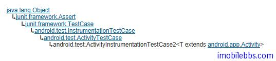

# Android 测试教程(10):ActivityInstrumentationTestCase2 示例

ActivityInstrumentationTestCase2 主要用来测试一个或多个 Activity 的功能测试，使用和最终应用同样的运行环境来测试 Activity 的功能。可以使用正常系统 Context (非 Mock）来测试 Activity 的功能。 并允许你创建一些 Mock Intent 用来测试 Activity 的响应。要注意的是，这种 TestCase 不允许使用 Mock 的 Context 和 Application 对象测试，也就是说你必须使用和应用程序实际运行的环境来测试。

ActivityInstrumentationTestCase2 的继承关系如下图所示：



它的 getActivity() 方法可以取得被测试的 Activity 的实例对象。

ApiDemosTest 的代码如下：

```

    public class ApiDemosTest
     extends ActivityInstrumentationTestCase2<ApiDemos> {
    
     public ApiDemosTest() {
     super(ApiDemos.class);
     }
    
    
     public void testActivityTestCaseSetUpProperly() {
     assertNotNull("activity should be launched successfully",
     getActivity());
     }
    }

```

测试方法 testActivityTestCaseSetUpProperly 使用 getActivity() ，主要目的是测试本测试的 Activity 能否正常启动，测试 getActivity() 是否非空。

此外 ActivityInstrumentationTestCase2 还提供了两个方法：

- etActivityInitialTouchMode(boolean) 在启动 Activity 之前设置 TouchMode
- setActivityIntent(Intent) 可以设置启动 Activity 的 Intent 对象来测试 Activity

Tags: [Android](http://www.imobilebbs.com/wordpress/archives/tag/android) [测试](http://www.imobilebbs.com/wordpress/archives/tag/%e6%b5%8b%e8%af%95)

