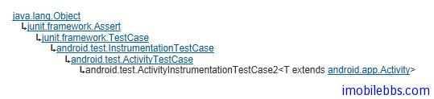

# Android 測試教程(14):ActivityInstrumentationTestCase2 示例

ActivityInstrumentationTestCase2 用來測試單個的 Activity，被測試的 Activity 可以使用 InstrumentationTestCase.launchActivity 來啟動，然後你能夠直接操作被測試的 Activity。

ActivityInstrumentationTestCase2 也支持：

- 可以在 UI 線程中運行測試方法.
- 可以注入 Intent 對象到被測試的 Activity 中

ActivityInstrumentationTestCase2  取代之前的 ActivityInstrumentationTestCase ，新的測試應該使用 ActivityInstrumentationTestCase2 作為基類。



Focus2ActivityTest 的代碼如下，用於測試 [Android ApiDemos 示例解析(116):Views->Focus->2. Horizontal](http://www.imobilebbs.com/wordpress/?p=1921)

```

    public class Focus2ActivityTest
     extends ActivityInstrumentationTestCase2<Focus2> {
    
     private Button mLeftButton;
     private Button mCenterButton;
     private Button mRightButton;
    
     public Focus2ActivityTest() {
     super("com.example.android.apis", Focus2.class);
     }
    
     @Override
     protected void setUp() throws Exception {
     super.setUp();
     final Focus2 a = getActivity();
     mLeftButton = (Button) a.findViewById(R.id.leftButton);
     mCenterButton = (Button) a.findViewById(R.id.centerButton);
     mRightButton = (Button) a.findViewById(R.id.rightButton);
     }
    
    
     @MediumTest
     public void testPreconditions() {
     assertTrue("center button should be right of left button",
     mLeftButton.getRight() < mCenterButton.getLeft());
     assertTrue("right button should be right of center button",
     mCenterButton.getRight() < mRightButton.getLeft());
     assertTrue("left button should be focused", mLeftButton.isFocused());
     }
    
     @MediumTest
     public void testGoingRightFromLeftButtonJumpsOverCenterToRight() {
     sendKeys(KeyEvent.KEYCODE_DPAD_RIGHT);
     assertTrue("right button should be focused", mRightButton.isFocused());
     }
    
     @MediumTest
     public void testGoingLeftFromRightButtonGoesToCenter()  {
    
     getActivity().runOnUiThread(new Runnable() {
     public void run() {
     mRightButton.requestFocus();
     }
     });
     // wait for the request to go through
     getInstrumentation().waitForIdleSync();
    
     assertTrue(mRightButton.isFocused());
    
     sendKeys(KeyEvent.KEYCODE_DPAD_LEFT);
     assertTrue("center button should be focused",
     mCenterButton.isFocused());
     }
    }

```

etUp 中初始化 mLeftButton，mCenterButton 和 mRightButton，調用每個測試方法之前，setUp 都會被調用。

testPreconditions 通常為第一個測試方法，用來檢測後續的測試環境是否符合條件。

testGoingRightFromLeftButtonJumpsOverCenterToRight 中調用 sendKeys 可以模擬按鍵消息。

testGoingLeftFromRightButtonGoesToCenter 中 ，使用 runOnUiThread 來為mRightButton 請求 focus ,使用 runOnUiThread 的原因是因為本測試方法不在 UI 線程中運行。  getInstrumentation 可以取得 Instrumentation 對象，有了 Instrumentation 對象就可以對 Activity 進行大部分的操作，waitForIdleSync（） 等待 application 回到 idle 狀態，之後就可以檢測 mRightButton 是否獲得了焦點。

Tags: [Android](http://www.imobilebbs.com/wordpress/archives/tag/android) [测试](http://www.imobilebbs.com/wordpress/archives/tag/%e6%b5%8b%e8%af%95)