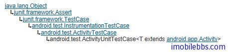

# Android 测试教程(11):ActivityUnitTestCase 示例

ActivityUnitTestCase 通常用来测试单独 Activity。在启动被测试的 Activity 之前，你可以 Inject 一个假的 Context 或是 Application ，使用这个 Mock 的 Context 中一个隔离环境中运行被测试的 Activity。通常用于 Activity 的单元测试，而不和 Anroid 系统进行交互。

ActivityUnitTestCase 的类继承关系如下图：



应该要注意的是，作为单纯的单元测试，被测试的 Activity 不运行在一般应用运行的环境中也不和其它 Activity 产生交互。在这种情况下，不能调用下面的方法，如果调用一般会抛出异常：

createPendingResult(int, Intent, int)  
startActivityIfNeeded(Intent, int)  
startActivityFromChild(Activity, Intent, int)  
startNextMatchingActivity(Intent)  
getCallingActivity()  
getCallingPackage()  
createPendingResult(int, Intent, int)  
getTaskId()  
isTaskRoot()  
moveTaskToBack(boolean)  

下面的方法可以调用，但一般不起任何作用，你可以使用 getStartedActivityIntent() 和 getStartedActivityRequest() 来检查参数值。

startActivity(Intent)  
startActivityForResult(Intent, int)

下面的方法也可以调用，一般也无效果，可以使用 isFinishCalled() 和 getFinishedActivityRequest 检查传入的参数。

finish()  
finishFromChild(Activity)  
finishActivity(int)  

ForwardingTest 的代码如下：

```

    public class ForwardingTest
     extends ActivityUnitTestCase<Forwarding> {
    
     private Intent mStartIntent;
     private Button mButton;
    
     public ForwardingTest() {
     super(Forwarding.class);
     }
    
     @Override
     protected void setUp() throws Exception {
     super.setUp();
    
     mStartIntent = new Intent(Intent.ACTION_MAIN);
     }
    
     @MediumTest
     public void testPreconditions() {
     startActivity(mStartIntent, null, null);
     mButton = (Button) getActivity().findViewById(R.id.go);
    
     assertNotNull(getActivity());
     assertNotNull(mButton);
     }
    
     @MediumTest
     public void testSubLaunch() {
     Forwarding activity
     = startActivity(mStartIntent, null, null);
     mButton = (Button) activity.findViewById(R.id.go);
    
     mButton.performClick();
    
     assertNotNull(getStartedActivityIntent());
     assertTrue(isFinishCalled());
     }
    
     @MediumTest
     public void testLifeCycleCreate() {
     Forwarding activity
     = startActivity(mStartIntent, null, null);
     getInstrumentation().callActivityOnStart(activity);
     getInstrumentation().callActivityOnResume(activity);
    
     getInstrumentation().callActivityOnPause(activity);
    
     getInstrumentation().callActivityOnStop(activity);
     }
    
    }

```

在 setUp 中，创建了一个 Mock Intent 对象 mStartIntent 用于测试 Activity。

按惯例测试方法 testPreconditions 通常作为第一个测试方法，如果该方法 Fail 的话，表示测试所需的条件不满足，此时其它测试一般也会 Fail 。但这个方法并不一定是第一个运行。

testSubLaunch 可以测试当前 Activity 能否成功启动其它 Activity，方法 getStartedActivityRequest 返回 当前 Activity 调用 startActivityForResult(Intent, int) 的 request code. 方法 isFinishCalled 将在当前 activity 调用 finish()  或 finishActivity, finishFromChild 后返回 true. [Forwarding 示例参照 Android ApiDemos 示例解析(7):App->Activity->Forwarding](http://www.imobilebbs.com/wordpress/?p=1071)

testLifeCycleCreate 测试 Activity 的生命周期回调函数，使用 getInstrumentation 取的 Instrumentation 对象，通过 Instrumentation 对象可以调用 Activity 对应的生命周期回调函数来测试 Activity 的 onCreate, onStart,onResume 等方法。

ActivityUnitTestCase 还提供了 sendKeys 方法模拟按键事件，可以用来测试 UI。

Tags: [Android](http://www.imobilebbs.com/wordpress/archives/tag/android) [测试](http://www.imobilebbs.com/wordpress/archives/tag/%e6%b5%8b%e8%af%95)