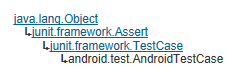

# Android 測試教程(15):AndroidTestCase 示例

AndroidTestCase 為一 Android 平台下通用的測試類，它支持所有 JUnit 的 Assert 方法和標準的 setUp 和 tearDown 方法。如果你的測試需要訪問應用的資源或者測試方法依賴於 Context，可以使用 AndroidTestCase 作為基類。

它的類繼承關係如下圖所示：



Focus2AndroidTest 測試也是 [Android ApiDemos 示例解析(116):Views->Focus->2. Horizontal](http://www.imobilebbs.com/wordpress/archives/2751?p=1921)

但測試的側重點不一樣，Focus2AndroidTest 測試的內容無需啟動 Activity，而是測試 R.layout.focus_2 的布局（資源）中 Focus 的順序是否符合預先設計（可以看作是 Activity 的一些靜態性能），可以通過 FocusFinder 的方法來測試 Focus 的一些靜態屬性，它的代碼如下：

```

    public class Focus2AndroidTest
     extends AndroidTestCase {
    
     private FocusFinder mFocusFinder;
    
     private ViewGroup mRoot;
    
     private Button mLeftButton;
     private Button mCenterButton;
     private Button mRightButton;
    
     @Override
     protected void setUp() throws Exception {
     super.setUp();
    
     mFocusFinder = FocusFinder.getInstance();
    
     // inflate the layout
     final Context context = getContext();
     final LayoutInflater inflater = LayoutInflater.from(context);
     mRoot = (ViewGroup) inflater.inflate(R.layout.focus_2, null);
    
     // manually measure it, and lay it out
     mRoot.measure(500, 500);
     mRoot.layout(0, 0, 500, 500);
    
     mLeftButton = (Button) mRoot.findViewById(R.id.leftButton);
     mCenterButton = (Button) mRoot.findViewById(R.id.centerButton);
     mRightButton = (Button) mRoot.findViewById(R.id.rightButton);
     }
    
    
     @SmallTest
     public void testPreconditions() {
     assertNotNull(mLeftButton);
     assertTrue("center button should be right of left button",
     mLeftButton.getRight() < mCenterButton.getLeft());
     assertTrue("right button should be right of center button",
     mCenterButton.getRight() < mRightButton.getLeft());
     }
    
     @SmallTest
     public void testGoingRightFromLeftButtonJumpsOverCenterToRight() {
     assertEquals("right should be next focus from left",
     mRightButton,
     mFocusFinder.findNextFocus(mRoot, mLeftButton,
     View.FOCUS_RIGHT));
     }
    
     @SmallTest
     public void testGoingLeftFromRightButtonGoesToCenter() {
     assertEquals("center should be next focus from right",
     mCenterButton,
     mFocusFinder.findNextFocus(mRoot, mRightButton,
     View.FOCUS_LEFT));
     }
    }

```

testGoingRightFromLeftButtonJumpsOverCenterToRight 和 testGoingLeftFromRightButtonGoesToCenter

通過 mFocusFinder 的 findNextFocus 來測試 mLeftButton，mRightButton 的下個可以獲取焦點的控制項是否符合事先的設計。

Tags: [Android](http://www.imobilebbs.com/wordpress/archives/tag/android) [测试](http://www.imobilebbs.com/wordpress/archives/tag/%e6%b5%8b%e8%af%95)

