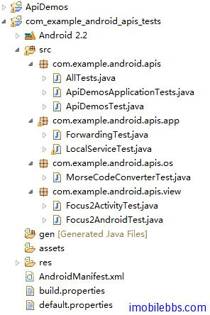
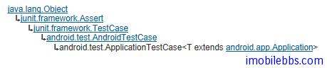

# Android 测试教程(9):ApplicationTestCase 示例

前面介绍了 Android 测试的一些理论知识，从本篇开始的几篇将结合 ApiDemoTest 示例来介绍 Android 测试的实例。在此之前可以参照 [Android 测试教程(3):测试项目](test-project.md) 创建 ApiDemos->tests 测试项目，本项目测试用来测试 ApiDemos，主要目的是介绍 Android 测试框架的使用方法。

当然要测试 ApiDemos，事先要创建好项目 ApiDemos。下图显示了创建好 ApiDemos->Tests 后，ApiDemos->Tests 中所含的 Java 类：



Android 测试项目也是一个 Android 应用项目，其基本使用方法和开发一般的 Android 应用非常类似，Android 测试项目主要是利用 Android 测试框架编写测试用例来测试对应的 Android 应用的各个方面。

其中 AllTests.java 定义如下：

```

    public class AllTests extends TestSuite {
    
     public static Test suite() {
     return new TestSuiteBuilder(AllTests.class)
     .includeAllPackagesUnderHere()
     .build();
     }
    }

```

使用 TestSuiteBuilder 指明所有该包和其子包中定义的 TestCase 都为最终 TestSuite 的一部分（需要被运行的测试）。

AllTests.java 一般可以不用修改的应用到大部分的测试项目中，如果有特殊需要，可以使用android.test.suitebuilder 的类定义那些 Testcase 需要包含到最终的测试包(Test Suite)中.

ApiDemosApplicationTests 测试介绍 ApplicationTestCase 的基本使用方法。

下图为 ApplicationTestCase 的继承关系：



ApplicationTestCase 主要用来测试 Application 类，提供了对 Application 类生命周期方法的基本支持，并可以支持一些 dependency injection 以帮助构造测试 Application 的的环境。

**Application Lifecycle 支持**， 每个 Application 运行 都遵循一定的顺序（生命周期方法），ApplicationTestCase 提供下面方法来支持对 Application 生命周期方法的测试： 

- 只有当测试用例调用 createApplication() 后才会执行 Application 的 onCreate 方法，从而使得你有机会在调用 Application的onCreate 方法之前对测试框架做些调整。
- 当测试用例结束时，测试用例的 tearDown 方法会被调用，然后会调用 Application 的 onDestroy() 方法停止和销毁 Application.

**Dependency Injection** 每个 Application 都依赖于运行它的 Context 对象，Android 测试框架允许你注入一个 Mock 的或者孤立的 context 对象，以实现真正的单元测试，如果只是想做一般的测试，你的 Application 方法将被注入全功能的 Context 对象，你可以使用 setContext 来注入你定义的 Mock 的 Context 对象，setContext 必须在 createApplication 之前调用。测试框架提供了如 MockContext, RenamingDelegatingContext, ContextWrapper 来帮助你构造用于测试 Applicaton 的 Context 对象。

本例的代码如下：

```

    public class ApiDemosApplicationTests
     extends ApplicationTestCase<ApiDemosApplication> {
    
     public ApiDemosApplicationTests() {
     super(ApiDemosApplication.class);
     }
    
     @Override
     protected void setUp() throws Exception {
     super.setUp();
     }
    
     @SmallTest
     public void testPreconditions() {
     }
    
     /**
     * Test basic startup/shutdown of Application
     */
     @MediumTest
     public void testSimpleCreate() {
     createApplication();
     }
    
    }

```

有几个新知识

1. @SmallTest 和 @MediumTest 标注

Android 测试框架可以使用 @SmallTest,@MediumTest 和 @LargeTest 来标注测试方法，这些分类划分主要是根据测试访问数据的位置，如本地，SD 卡，网络，下表为通常划分测试等级的基本方法：

<table class="table table-bordered table-striped table-condensed">
   <tr>
      <td>Feature</td>
      <td>Small</td>
      <td>Medium</td>
      <td>Large</td>
   </tr>
   <tr>
      <td>Network access</td>
      <td>No</td>
      <td>localhost only</td>
      <td>Yes</td>
   </tr>
   <tr>
      <td>Database</td>
      <td>No</td>
      <td>Yes</td>
      <td>Yes</td>
   </tr>
   <tr>
      <td>File system access</td>
      <td>No</td>
      <td>Yes</td>
      <td>Yes</td>
   </tr>
   <tr>
      <td>Use external systems</td>
      <td>No</td>
      <td>Discouraged</td>
      <td>Yes</td>
   </tr>
   <tr>
      <td>Multiple threads</td>
      <td>No</td>
      <td>Yes</td>
      <td>Yes</td>
   </tr>
   <tr>
      <td>Sleep statements</td>
      <td>No</td>
      <td>Yes</td>
      <td>Yes</td>
   </tr>
   <tr>
      <td>System properties</td>
      <td>No</td>
      <td>Yes</td>
      <td>Yes</td>
   </tr>
   <tr>
      <td>Time limit (seconds)</td>
      <td>60</td>
      <td>300</td>
      <td>900+</td>
   </tr>
</table>

2.testPreconditions

testPreconditions 测试主要用来运行其它测试方法之前来校验 Application 对象的初始化情况，和 setUp 类似，但和 setUp 不同的是，testPreconditions 只会被运行一次，而 setUp 通常在执行每个测试方法之前都会运行一次，一般需把它做为 Application 第一个测试方法，但由于 JUnit 使用 Reflection 来取得测试方法，因此并不一定能保证 testPreconditions 一定在其它测试方法之前运行。

testSimpleCreate 为测试 Application 的测试方法，调用 createApplication 会触发 Application 的onCreate 方法，测试结束后，执行 tearDown ，然后调用 Application 的 onDestroy 方法，如果 Application 的 onCreate, onDestroy 运行抛出异常的话，则本测试方法失败，否则表示测试通过。

ApplicationTestCase 还提供了一个 terminateApplication 中止 Application，可以测试 Application 的 onTerminate 方法。

Tags: [Android](http://www.imobilebbs.com/wordpress/archives/tag/android) [测试](http://www.imobilebbs.com/wordpress/archives/tag/%e6%b5%8b%e8%af%95)