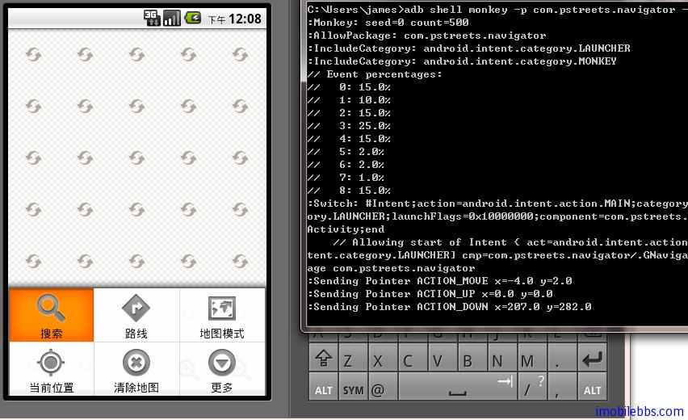

# Android 测试教程(17):Monkey 命令行工具

写完应用之后，作完单元测试和功能测试，有必要对应用的抗打击能力做个测试，最好的方法是雇个“猴子”在测试，猴子可以胡乱瞎按键，在这种情况下，你的应用是否还能正常工作呢？

Android 测试包中提供了一个 Monkey 工具，就提供了“猴子”功能，不过比真”猴子“还要智能一些，你还可以指挥这个猴子， 比如按键的比例，触发某个事件的频率等等。

一个简单的用法，比如你的应用程序的包名为：com.pstreets.navigator

可以使用  adb shell monkey -p com.pstreets.navigator -v 500

使用缺省的配置 向应用发送 500 个随机事件（包括按键，touch 事件，系统事件等），该命令会首先启动对应的 Activity，然后向该应用发送随机事件：

Monkey 工具的详细说明如下：

它是一个命令行工具 ，可以运行在模拟器里或实际设备中。它向系统发送伪随机的用户事件流，实现对正在开发的应用程序进行压力测试。Monkey 包括许多选项，它们大致分为四大类：

- 基本配置 选项，如设置尝试的事件数量。
- 运行约束选项，如设置只对单独的一个包进行测试。
- 事件类型 和频率。
- 调试选项。

在 Monkey 运行的时候，它生成事件，并把它们发给系统。同时，Monkey 还对测试中的系统进行监测，对下列三种情况进行特殊处理：

- 如果限定了 Monkey 运行在一个或几个特定的包上，那么它会监测试图转到其它包的操作，并对其进行阻止。
- 如果应用程序崩溃或接收到任何失控异常 ，Monkey 将停止并报错。
- 如果应用程序产生了应用程序不响应(application not responding)的错误，Monkey 将会停止并报错。

按照选定的不同级别的反馈信息，在 Monkey 中还可以看到其执行过程报告和生成的事件。

Monkey 基本用法

可以通过开发机器上的命令行或脚本来启动 Monkey。由于 Monkey 运行在模拟器/设备环境中，所以必须用其环境中的 shell 来进行启动。可以通过在每条命令前加上 adb shell 来达到目的，也可以进入 Shell 后直接输入 Monkey 命令。基本语法如下：

    $ adb shell monkey [options]

如果不指定 options，Monkey 将以无反馈模式启动，并把事件任意发送到安装 在目标环境中的全部包。下面是一个更为典型的命令行示例，它启动指定的应用程序，并向其发送 500 个伪随机事件：

    $ adb shell monkey -p your.package.name -v 500
    –v

命令行的每一个 -v 将增加反馈信息的级别。 Level 0( 缺省值 ) 除启动提示、测试完成和最终结果之外，提供较少信息。 Level 1 提供较为详细的测试信息，如逐个发送到 Activity 的事件。 Level 2 提供更加详细的设置信息，如测试中被选中的或未被选中的 Activity 。
事件
    
-s <seed>

伪随机数生成器的 seed 值。如果用相同的 seed 值再次运行 Monkey ，它将生成相同的事件序列。

–throttle <milliseconds>

在事件之间插入固定延迟。通过这个选项可以减缓 Monkey 的执行速度。如果不指定该选项， Monkey 将不会被延迟，事件将尽可能快地被产成。
   
–pct-touch <percent>

调整触摸事件的百分比 ( 触摸事件是一个 down-up 事件，它发生在屏幕上的某单一位置 ) 。
   
–pct-motion <percent>

调整动作事件的百分比 ( 动作事件由屏幕上某处的一个 down 事件、一系列 的伪随机事件和一个 up 事件组成 ) 。

–pct-trackball <percent>

调整轨迹事件的百分比 ( 轨迹事件由一个或几个随机的移动组成，有时还伴随有点击 ) 。

–pct-nav <percent>

调整“基本”导航事件的百分比 ( 导航事件由来自方向输入设备的 up/down/left/right 组成 ) 。

–pct-majornav <percent>

调整“主要”导航事件的百分比 ( 这些导航事件通常引发图形界面中的动作，如： 5-way 键盘的中间按键、回退按键、菜单按键 )

–pct-syskeys <percent>

调整“系统”按键事件的百分比 ( 这些按键通常被保留，由系统使用，如 Home 、 Back 、 Start Call 、 End Call 及音量控制键 ) 。

–pct-appswitch <percent>

调整启动 Activity 的百分比。在随机间隔里， Monkey 将执行一个 startActivity () 调用，作为最大程度覆盖包中全部 Activity 的一种方法。

–pct-anyevent <percent>

调整其它类型事件的百分比。它包罗了所有其它类型的事件，如：按键、其它不常用的设备按钮、等等。
约束限制

-p <allowed-package-name>

如果用此参数指定了一个或几个包， Monkey 将只允许系统启动这些包里的 Activity 。如果你的应用程序还需要访问其它包里的 Activity( 如选择取一个联系人 ) ，那些包也需要在此同时指定。如果不指定任何包， Monkey 将允许系统启动全部包里的 Activity 。要指定多个包，需要使用多个 -p 选项，每个 -p 选项只能用于一个包。

-c <main-category>

如果用此参数指定了一个或几个类别， Monkey 将只允许系统启动被这些类别中的某个类别列出的 Activity 。如果不指定任何类别， Monkey 将选择下列类别中列出的 Activity ： Intent.CATEGORY_LAUNCHER 或 Intent.CATEGORY_MONKEY 。要指定多个类别，需要使用多个 -c 选项，每个 -c 选项只能用于一个类别。

调试

–dbg-no-events

设置此选项， Monkey 将执行初始启动，进入到一个测试 Activity ，然后不会再进一步生成事件。为了得到最佳结果，把它与 -v 、一个或几个包约束、以及一个保持 Monkey 运行 30 秒或更长时间的非零值联合起来，从而提供一个环境，可以监视应用程序所调用的包之间的转换。

–hprof

设置此选项，将在 Monkey 事件序列之前和之后立即生成 profiling 报告。这将会在 data/misc 中生成大文件 (~5Mb) ，所以要小心使用它。

–ignore-crashes

通常，当应用程序崩溃或发生任何失控异常时， Monkey 将停止运行。如果设置此选项， Monkey 将继续向系统发送事件，直到计数完成。

–ignore-timeouts

通常，当应用程序发生任何超时错误 ( 如“ Application Not Responding ”对话框 ) 时， Monkey 将停止运行。如果设置此选项， Monkey 将继续向系统发送事件，直到计数完成。

–ignore-security-exceptions

通常，当应用程序发生许可错误 ( 如启动一个需要某些许可的 Activity) 时， Monkey 将停止运行。如果设置了此选项， Monkey 将继续向系统发送事件，直到计数完成。

–kill-process-after-error

通常，当 Monkey 由于一个错误而停止时，出错的应用程序将继续处于运行状态。当设置了此选项时，将会通知系统停止发生错误的进程。注意，正常的 ( 成功的 ) 结束，并没有停止启动的进程，设备只是在结束事件之后，简单地保持在最后的状态。

–monitor-native-crashes

监视并报告 Android 系统中本地代码的崩溃事件。如果设置了 –kill-process-after-error ，系统将停止运行。

–wait-dbg

停止执行中的 Monkey ，直到有调试器和它相连接。

Tags: [Android](http://www.imobilebbs.com/wordpress/archives/tag/android) [测试](http://www.imobilebbs.com/wordpress/archives/tag/%e6%b5%8b%e8%af%95)

 
