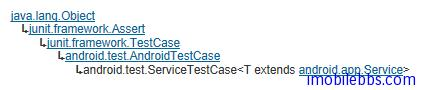

# Android 測試教程(12):ServiceTestCase 示例

ServiceTestCase 為測試 Service 提供了一個可控的測試環境，它提供對 Service 生命周期的基本支持，並可以通過注入一些依賴對象來控制測試環境以便測試 Service。

ServiceTestCase  的類繼承如下圖所示：



**Service Lifecycle 支持**， 每個 Service 運行 都遵循一定的順序（生命周期方法），ServiceTestCase 提供下面方法來支持對 Service 生命周期方法的測試：

- 每個測試方法調用之前首先會執行 setUp 方法，setUp 的基本實現是取得系統 Context ，如果你要重載 setUp 的話，注意在第一行加上 super.setUp.
- 在調用 startService(Intent) 或 bindService(Intent) 之後，ServiceTestCase 才會調用 Service 的 onCreate 方法，從而使你有機會在 Service 啟動之前對測試環境做些調整。
- 當你的測試方法調用 startService(Intent) 或 bindService(Intent) 之後，ServiceTestCase 調用 Service 的 onCreate 方法，然後再調用 Service 相應的 startService(Intent) 或 service 的bindService(Intent, ServiceConnection, int)方法。並保存用於 tracking 和支持 Lifecycle 對應的值。
- 每個測試方法結束後，調用 tearDown 方法，這個方法 stop 並destroy 被測試的 service. 如果你需要重載 tearDown, 注意先調用 super.tearDown.
 
**Dependency Injection** 每個 Service 都依賴於運行它的 Context 對象和 Application 對象，ServiceTestCase 測試框架允許你注入這些對象（修改過，Mocked 等）以實現真正的單元測試.

LocalServiceTest 的代碼如下：

```

    public class LocalServiceTest
     extends ServiceTestCase<LocalService> {
    
     public LocalServiceTest() {
     super(LocalService.class);
     }
    
     @Override
     protected void setUp() throws Exception {
     super.setUp();
     }
    
     @SmallTest
     public void testPreconditions() {
     }
    
     /**
     * Test basic startup/shutdown of Service
     */
     @SmallTest
     public void testStartable() {
     Intent startIntent = new Intent();
     startIntent.setClass(getContext(), LocalService.class);
     startService(startIntent);
     }
    
     /**
     * Test binding to service
     */
     @MediumTest
     public void testBindable() {
     Intent startIntent = new Intent();
     startIntent.setClass(getContext(), LocalService.class);
     IBinder service = bindService(startIntent);
     }
    
    }

```

testStartable 測試對應的 Service 能否正常啟動。

testBindable 測試對應的 Service 能否綁定成功

Tags: [Android](http://www.imobilebbs.com/wordpress/archives/tag/android) [测试](http://www.imobilebbs.com/wordpress/archives/tag/%e6%b5%8b%e8%af%95)