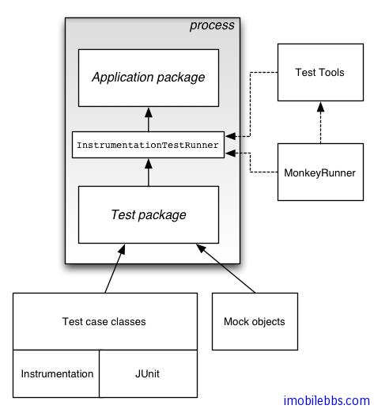

# Android 测试教程(2):测试基础

Android 测试框架(Android Testing Framework)为 Android 开发环境的一个组成部分，可以用来测试 Android 的各个方面，从单元测试到框架测试到 UI 测试等。

其主要功能有：

- Android 测试框架基于 JUnit，因此可以直接使用 JUnit 来测试一些与 Android 平台不是很相关的类，或者使用 Android 的 JUint 扩展来测试 Android 组件，如果你刚开始接触 Android 测试，可以先从 AndroidTestCase 写一些通用的测试用例，然后再写较复杂的测试用例。
- Android JUint 扩展提供了对 Android 特定组件（如 Activity，Service）的测试支持，这些扩展类提供了一些辅助方法来帮助创建测试使用的“桩”类或方法。
- 创建的测试包包含中一个测试包中，这个测试包和主应用程序包具有类似的结构，创建测试包的步骤和创建 Android 应用的方法基本类似。
- Eclipse 的 ADT 包含了创建测试用例的 SDK 工具，并提供用于和其它 IDE 集成的命令行工具。这些工具可以从被测试的应用程序包读取所需信息用于创建测试项目的 build 文件，mainfest 文件和文件目录结构等。
- SDK 也提供了一个 moneyrunner （一个 python 应用）可以模拟用户按键事件来测试 UI。

下图为 Android 测试框架的一个总结：

Tags: [Android](http://www.imobilebbs.com/wordpress/archives/tag/android) [测试](http://www.imobilebbs.com/wordpress/archives/tag/%e6%b5%8b%e8%af%95)