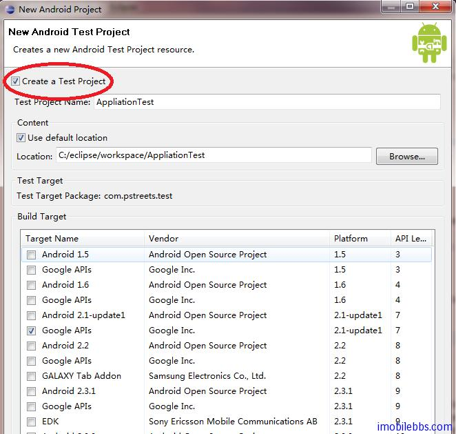
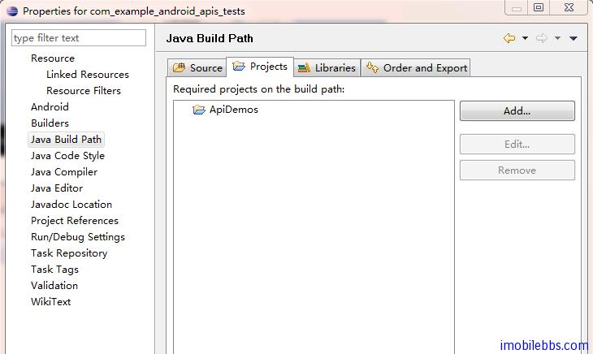

# Android 测试教程(3):测试项目

Android 的编译和测试工具需要测试项目组织符合预订的结构:分别为 Test case 类，Test case 包以及测试项目。

JUnit 为 Android 的测试的基础，一般来说，一个 JUint 测试为一个用来测试一个应用某一部分的语句。 你可以将多个测试 Test 方法组织起来构成一个测试用例(Test case)，多个测试用例可以构成 Test Suites 。 每个 Test 方法相对独立，一个测试类 Test class 包含一组相关的 Test 或其它辅助方法。

在 Android 平台上，你可以使用测试工具调入 Test Package 和所要测试的应用，然后执行 Test Runner 来运行测试用例。

使用 Eclipse ADT 工具创建测试项目的方法：

1. 在创建应用的同时创建测试项目，如下图

选中 Create a Test Project ，ADT 自动为应用创建对应的测试项目

2.导入已有的测试项目，并和被测试的应用关联。

Android SDK 自带 ApiDemo，并带有其对应的测试项目 ApiDemos->Test. 打开 ApiDemos->Test 的方法如下，首先是选中 Build Target （比如 Android 2.2),然后选择 Create project from existing sample, 从下拉列表中选择 ApiDemos ->Tests （注意你要先创建 [ApiDemos Android ApiDemos 示例解析(1)：创建 ApiDemo 示例](http://www.imobilebbs.com/wordpress/?p=1037)）

将 ApiDemos->tests 和 ApiDemos 关联起来：

修改 ApiDemos->tests 测试项目的属性，在 Java Build Path 的项目 Projects 中添加 ApiDemos

你最好使 Eclipse 工具创建测试项目：

- 自动为你的测试项目设置使用 InstrumentationTestRunner 作为运行 Test Package 的 Test Runner，测试项目必须使用 InstrumentationTestRunner 或其子类做为 Test Package 的 runner.
- 为测试项目创建合适的项目名称和测试包名称，比如你需要测试的应用的包名称为 com.mydomain.myapp 则自动创建的测试包名为 com.mydomain.myapp.test ，从测试包名可以很容易找到对应的应用程序包名称。
- 自动创建合适的 build 文件，mainifest 文件和文件目录结构。

建议使用的文件目录结构可以如下所示：

MyProject/  
—–AndroidManifest.xml  
—–res/  
——–… (resources for main application)  
—–src/  
——–… (source code for main application) …  
—–tests/  
———-AndroidManifest.xml  
———-res/  
————-… (resources for tests)  
———-src/  
————-… (source code for tests)  

Tags: [Android](http://www.imobilebbs.com/wordpress/archives/tag/android) [测试](http://www.imobilebbs.com/wordpress/archives/tag/%e6%b5%8b%e8%af%95)