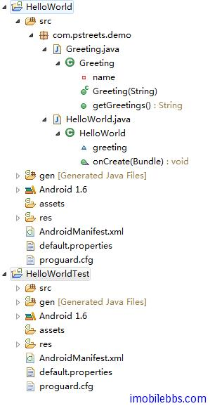
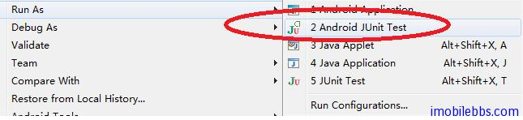
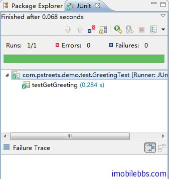

# Android 测试教程(5):第一个测试项目 HelloWorldTest

本例介绍创建一个测试项目的一般步骤和编写测试用例的基本方法。

为简单起见，创建一个 HelloWorld 应用，带有一个 Greeting 类，其定义如下：

```

    public class Greeting {
     private String name;
    
     public Greeting(String name){
     this.name=name;
     }
    
     public String getGreetings(){
     return "Hello," +name;
     }
    
    }

```

测试项目打算来测试这个 Greeting 类的 getGreetings 的方法，比如说，创建 Greeting(“World”) ，预期的 getGreetings 的值应为”Hello,World”。我们可以使用 JUnit 框架来编写一个测试用例。

这里我们在创建 HelloWorld 的项目的同时创建一个测试项目，参见 [Android 测试教程(3):测试项目](http://www.imobilebbs.com/wordpress/archives/2695?p=2675)



可以看到新创建的测试项目名称为 HelloWorldTest ，并在 src 中创建了 com.pstreets.demo.test 文件夹（和 HelloWorld 应用的 com.pstreets.demo  包相对应）。但 src 还没有任何代码。

可以看到 HelloWorldTest 属性的 Java Build Path-> Projects 中引用的 Project 为 HelloWorld, 表示在 HelloWorldTest 项目中可以引用 HelloWorld 项目中的类。

然后在 HelloWorldTest 的 src 的 com.pstreets.demo.test 中添加一个 AllTests.java,其定义如下：

```

    public class AllTests extends TestSuite {
    
     public static Test suite() {
     return new TestSuiteBuilder(AllTests.class)
     .includeAllPackagesUnderHere()
     .build();
     }
    }

```

使用 TestSuiteBuilder 指明所有该包和其子包中定义的 TestCase 都为最终 TestSuite 的一部分（需要被运行的测试）。

AllTests.java 一般可以不用修改的应用到大部分的测试项目中，如果有特殊需要，可以使用 android.test.suitebuilder 的类定义那些 Testcase 需要包含到最终的测试包(Test Suite)中.

定义了 AllTests.java ，这个测试项目就基本完整了，也可以运行了，只是还没有定义任何测试用例(Test case) 。

这里定义一个 GreetingTest ，用于测试 Greeting 类：

```

    public class GreetingTest extends TestCase {
    
     Greeting greeting;
    
     @Override
     public void setUp(){
     greeting=new Greeting("World");
    
     }
    
     @Override
     public void tearDown(){
    
     }
    
     public void testGetGreeting() {
     assertTrue(greeting.getGreetings()
     .compareToIgnoreCase("Hello,World")==0);
     }
    
    }

```

其实对于与这个例子 setUp 和 tearDown 不是必须的，如果多个 TestCase 使用同一组测试数据，可以在 setUp 中创建这些测试数据，JUnit 中运行每个 TestCase 前会运行 setUp ,运行 TestCase 后会执行 tearDown 。

JUnit 把以 test 开头的方法作为一个实例，也可以使用 annotation @Test 表示一个方法为测试方法。

GreetingTest 由 TestCase 派生，因为这里测试是一个普通 Java 类（和 Android 平台无关），也可以使用 AndroidTestCase 作为基类。

testGetGreeting 使用 assertTrue 来检测测试结果，预期的 getGreetings()的值为”Hello,World” ,如果为 true ,表示测试通过。

以 Android JUint Test 的方式运行 HelloWorldTest



运行 HelloWorldTest 时，Android 测试环境会自动启动 HelloWorld ，并在 JUint 窗口显示最终测试结果。



在开发应用过程中，可以一边编写应用，一边编写测试用例。

Tags: [Android](http://www.imobilebbs.com/wordpress/archives/tag/android) [测试](http://www.imobilebbs.com/wordpress/archives/tag/%e6%b5%8b%e8%af%95)